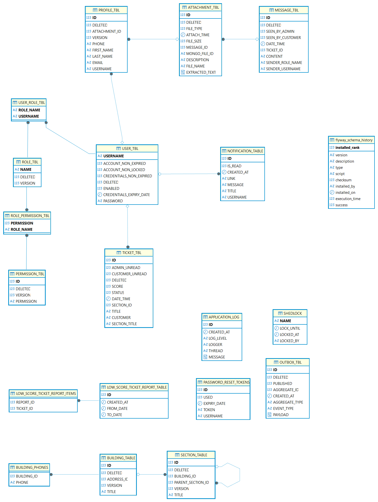
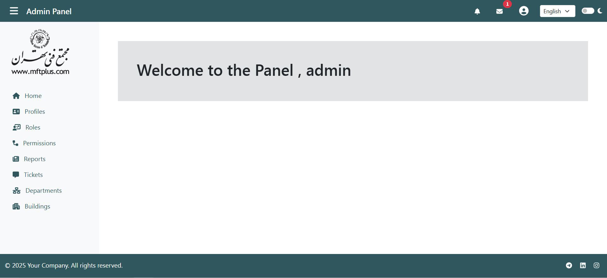
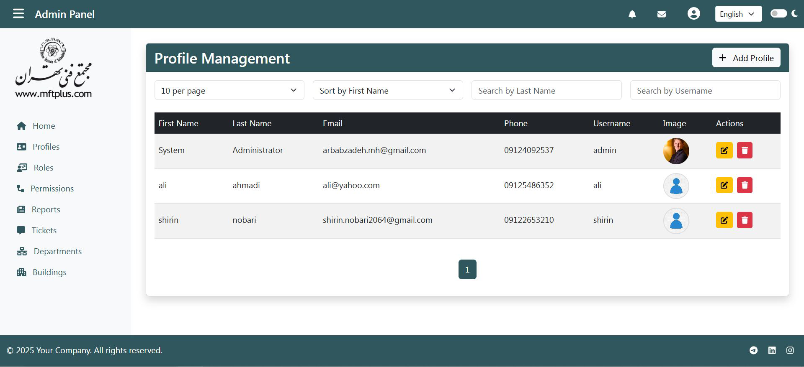
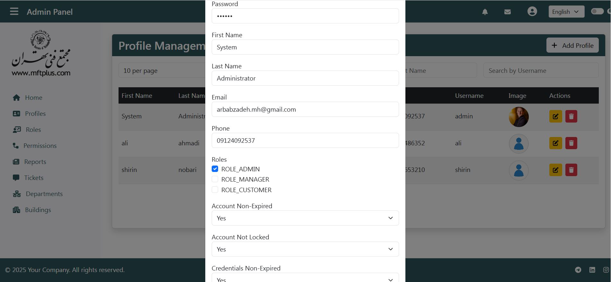
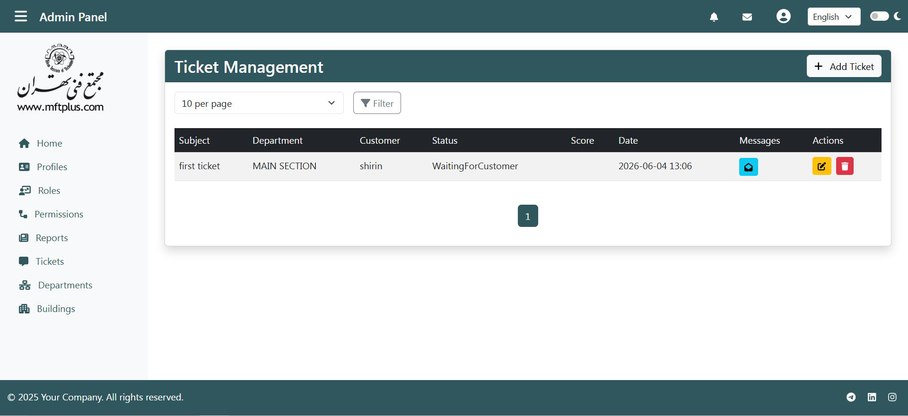
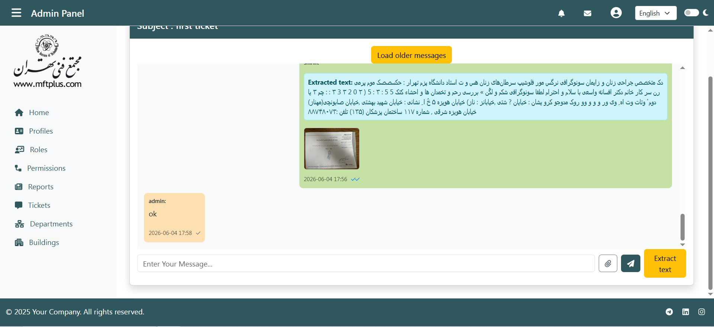
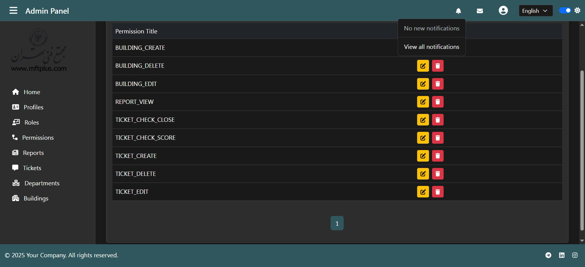
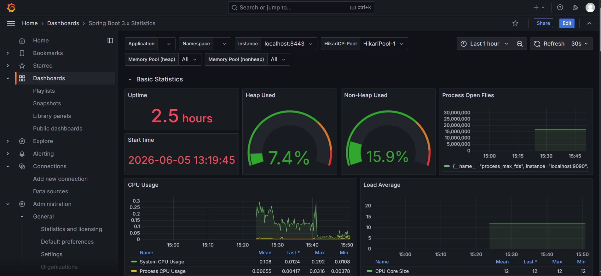

# Ticketing Spring Boot System


## Overview
Enterprise-style Ticketing Management System built with Spring Boot.

The project demonstrates:

- Spring Security
- Redis Cache
- Distributed Locking
- Kafka Messaging
- OCR Processing
- Monitoring
- Docker Deployment
- Multi Database Support

## Highlights

- Spring Boot 3.4
- PostgreSQL / Oracle Support
- MongoDB GridFS
- Redis Cache & Distributed Locking
- Kafka Messaging
- OCR with Tesseract
- Docker Deployment
- HTTPS & CSRF Protection
- Prometheus & Grafana Monitoring
- English / Persian Localization


## Architecture

### Application Layer
- Spring Boot
- Thymeleaf
- REST APIs

### Data Layer
- Oracle (Development)
- PostgreSQL (Production)
- MongoDB GridFS

### Infrastructure Layer
- Redis Cache
- Redis Distributed Lock
- Kafka Messaging
- ShedLock Scheduler

### Monitoring
- Spring Actuator
- Prometheus
- Grafana


## Database ER Diagram

- The diagram below shows the main database entities and their relationships.




## Features

### Security

- HTTPS
- SSL
- Session Authentication
- CSRF Protection
- Password Reset Tokens
- Role-Based Authorization

### Performance

- Redis Cache
- Distributed Locking
- Async Processing
- ShedLock Scheduled Jobs

### Storage

- PostgreSQL
- Oracle
- MongoDB GridFS

### Monitoring

- Spring Actuator
- Prometheus
- Grafana

### OCR

- Tesseract OCR
- Async OCR Processing

### File Upload

- Multipart Upload
- MIME Validation
- Extension Validation
- Filename Sanitization


## Technologies

### Backend
- Java 17
- Spring Boot 3.4
- Spring Security
- Spring Data JPA
- Hibernate

### Databases
- PostgreSQL
- Oracle
- MongoDB GridFS

### Infrastructure
- Redis
- Kafka
- Docker

### Monitoring
- Spring Actuator
- Prometheus
- Grafana

### Integration
- OpenFeign
- Email Service

### Frontend
- Thymeleaf
- JavaScript
- Bootstrap


### Other
- Flyway
- ShedLock
- Tesseract OCR


## Testing

The project includes both unit and integration tests with real database validation using Testcontainers.

Comprehensive automated test suite covering Controllers, Services and Repositories.

| Category | Coverage |
|-----------|---------:|
| Controller & REST API Tests | 127 |
| Service Tests | 155 |
| Repository Tests | 53 |
| **Total Test Methods** | **335** |

### Technologies

- JUnit 5
- Mockito
- Spring Boot Test
- MockMvc
- Testcontainers
- PostgreSQL

### Repository Tests

Repository tests run against a real PostgreSQL database using Testcontainers instead of an in-memory database to validate:

- Derived Spring Data queries
- JPQL queries
- Pagination
- Sorting
- Custom update queries
- Entity relationships
- Repository specifications

### Service Tests

Business logic is verified using mocked dependencies, including:

- Validation
- Exception handling
- Redis Cache
- Distributed Locking
- Kafka messaging
- OCR processing
- Email service

### Controller Tests

Controller tests verify:

- MVC Controllers
- REST APIs
- Spring Security
- Request validation
- HTTP responses
- JSON serialization
- Exception handling

### Testing Strategy

- Unit Tests
- Integration Tests
- Repository Tests (Testcontainers)
- MVC Tests
- REST API Tests
- Security Tests

## Performance Test Results

- Load tests were performed using k6.

### Load Tests

- Tested with up to 200 concurrent users
- More than 32,000 requests executed successfully
- 0% error rate in primary load tests
- Stable during 30-minute endurance testing
- Redis failure scenarios tested successfully
- OCR processing tested under load

| Test | Result |
|--------|---------|
| GET APIs | 407 req/s |
| POST APIs | 404 req/s |
| Mixed APIs | 10,932 requests |
| Upload | 8,790 uploads |
| Concurrent Users | 200 |
| Error Rate | 0% |

System remained stable under all major tests.


## Security Features

- HTTPS
- CSRF Protection
- Secure Cookies
- Session Fixation Protection
- CSP Headers
- XSS Protection
- File Upload Security
- OCR Bomb Protection

## Screenshots

### Dashboard



### Profile List



### Edit Modal



### Ticket List



### File Upload



### Dark Theme



### Grafana Monitoring




## Default Admin

### The default administrator account is created automatically on first startup.

- Username: admin
- Password: admin

## Run with Docker

```bash
docker compose up -d
```

Application:

```text
https://localhost:8443
```

- Copy .env.example to .env and update values.

## Key Features

- Redis Distributed Locking for concurrent editing protection
- Optimistic Locking using @Version
- Async OCR processing with Tesseract
- MongoDB GridFS file storage
- Kafka-based messaging
- Multi-language support (English / Persian)
- Prometheus & Grafana monitoring
- HTTPS + CSRF secured application
- Flyway database versioning and migration
- Centralized exception handling
- Audit logging to database and log files

## Future Improvements

- Kubernetes Deployment
- JWT Authentication
- Elasticsearch Integration
- Multi-node Kafka Cluster

## License

This project is provided for educational and portfolio purposes.